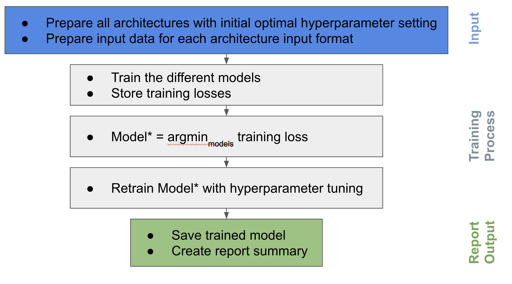
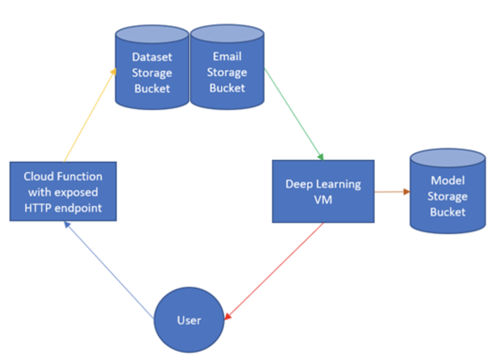

# DeepCNN-as-a-Service
Selection and Optimization of Deep Convolutional Neural Networks as a Service.

Yanis Tazi & Erik Weissenborn

# New York University - Computer Science - Deep Learning Systems

-------------------------
Motivation
-------------------------
Model selection, training, and finetuning of a Convolutional Neural Net is a time consuming and tedious task. It often requires multiple repetitions of training with various hyperparameter configurations. We decided to formalize this process by constructing a cloud service that would enable the user to upload a previously unseen labeled dataset and return to the user a highly accurate and finetuned CNN that is ready for use. The user will be emailed a report, which displays the finetuned model’s training and validation accuracy, training loss, and a confusion matrix with test results. The cloud solution offers an efficient way for users to obtain a finetuned CNN model that they can begin using out of the box for inference.

-------------------------
Training Workflow
-------------------------

-------------------------
Cloud Service Workflow
-------------------------

--------------------
Conclusion
--------------------

Given training time and cost constraints, we decided to come up with initial models and initial hyperparameters settings as optimal as possible . To do so, we performed an in-depth review of the literature to select the state of the art convolutional neural network architectures and investigated how transfer learning can be used on those architectures to further improve performances. Doing so, we were able to identify critical points (where to retrain and where to cut the preexisting architectures) in which transfer learning is useful i.e can learn general feature representation that can be transferred to any image dataset. In addition to that, it has been shown that a good hyperparameter initialization i.e learning rate, batch size , optimizer,... is critical to the network so we came up with a general suboptimal initialization scheme for those parameters . The process for choosing the best architecture is simple since we will just chose the architecture with the best performance and then fine-tune the hyperparameters of this specific architecture . In conclusion, this process is a simple end-to-end solution that is not costly and gives in general very good performances thanks to a god initialization scheme and the selection of the best architecture that is again finetuned. 

--------------------
Additional Notes
--------------------

Please feel free to use our Cloud Service . We will be improving the service using genetic algorithm search for hyperparameter optimization and P2L to predict, from a set of "source" models, the one model most likely to produce effective transfer for training a given "target" model.
